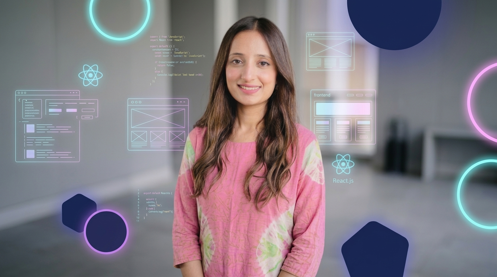

  

### 💻 Frontend Web Developer | 🎓 Computer Science Student

---

# 💫 About Me
- 👩‍💻 Computer Science Student
- 💻 Passionate about Frontend Development
- ⚛️ Currently Learning React.js
- 🚀 Building Modern & Responsive Websites
- 🌱 Always Exploring New Technologies

---

# 🌐 Connect With Me

---

# 💻 Tech Stack

---

# 📊 GitHub Stats

---

# 📈 Contribution Graph

---

## 📌 GitHub Overview

# 🚀 Featured Projects
🌸 **Portfolio Website** *(Coming Soon)*  
🛍️ **Scrunchies Store Website**  
💾 **Digital Memory Vault**  
📚 **Student Attendance Management System**

---

# 🌱 Currently Learning
- React.js
- JavaScript
- Responsive Web Design
- Modern Frontend Development

---

# 👀 Profile Views

---

### 🌸 Thanks for visiting my profile! 🌸

